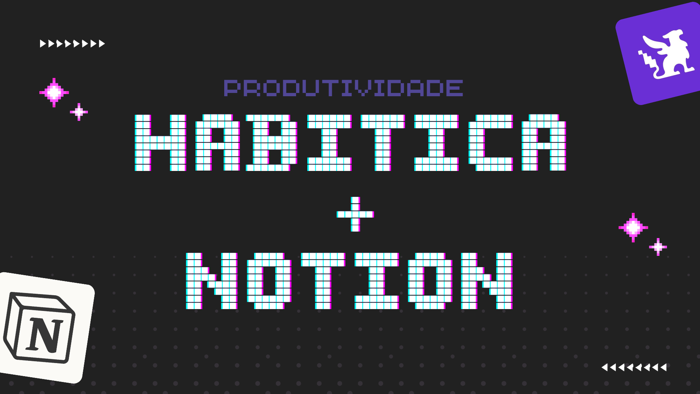

Se você, assim como eu, usa o _Habitica_ e o _Notion_ para produtividade, organização e planejamento pessoal, vai gostar dessa dica. Caso não conheça tais ferramentas, permita-me apresentá-las.

O <a href="https://habitica.com/static/home" target="_blank">Habitica</a> é uma ferramenta de gamificação que ajuda as pessoas a estabelecer e manter hábitos saudáveis, melhorar a produtividade e alcançar metas pessoais. Os usuários podem criar um avatar, definir tarefas, hábitos e metas, e ganhar recompensas virtuais ao completá-los. É uma maneira divertida e motivadora de acompanhar o progresso e se manter focado em objetivos pessoais. Já o <a href="https://www.notion.so/pt-br" target="_blank">Notion</a> é uma ferramenta tudo-em-um de organização e produtividade que combina elementos de aplicativos de notas, gerenciadores de tarefas, bancos de dados e wikis em uma única plataforma. Ele permite aos usuários criar e gerenciar notas, listas de tarefas, projetos, bancos de dados, calendários e muito mais, tudo dentro de uma interface intuitiva e personalizável. É uma poderosa ferramenta de organização e produtividade que se adapta às necessidades individuais e de equipe, oferecendo uma maneira flexível e personalizável de gerenciar informações, projetos e tarefas.

Recentemente descobri o <a href="https://www.make.com/en" target="_blank">Make</a>, que é uma ferramenta de automação e gerenciamento de tarefas que permite aos usuários criar fluxos de trabalho automatizados para realizar diversas tarefas repetitivas. Com o Make, os usuários podem criar fluxos que consistem em etapas sequenciais para automatizar processos como organização de arquivos, envio de e-mails, atualização de bancos de dados e muito mais.

Nesse tutorial vamos aprender a utilizar o Make para integrar o Habitica ao Notion e conseguir criar itens em base de dados do Notion a partir de uma nova tarefa no Habitica. Vamos lá!

---
1. Acesse o site oficial do <a href="https://www.make.com/en" target="_blank">Make</a>, clique no botão `Get started free` e escolha uma opção para fazer seu registro na plataforma.
---
2. Depois de responder algumas perguntas e finalizar seu cadastro, você verá a sua tela de _dashboard_. Vamos criar nosso `scenario`, que são conjuntos predefinidos de tarefas e ações que podemos criar e reutilizar para automatizar processos específicos. Em vez de criar um fluxo de trabalho do zero, vamos selecionar um cenário existente que corresponda ao que desejamos realizar. **Clique em `More`** do seu lado esquerdo da tela e **depois em `Templates`**.
---
3. Na barra de pesquisa no canto superior direito, pesquise por Habitica e escolha a opção que se refere a crição de itens em base de dados Notion por meio do Habitica.
	
---
4. Vamos fazer as configurações necessárias! Clique em `Create new scenario from template` no lado esquerdo.
	 
---
5. Vamos começar pelo Habitica. Clique na logo e em seguida em `Create a webhook`. Você pode deixar o nome do seu _Webhook_ como está ou renomear. Depois clique em `Create a connection`.
---
6. Agora vamos criar a conexão entre o Make e o Habitica, para isso, vamos precisar da _Api Key_ e _User ID_ do seu usuário no Habitica. Basta ir até as configurções de sua conta no Habitica e clicar em `Dados do Site`, você terá acesso as informações. Copie e cole nos campos correspondentes. Feito isso, clique para salvar e depois `Save` de novo, para finalizar, clique em `OK`. Já temos nossa conexão com o Habitica.
---
7. O processo é um pouco parecido com o Notion. Clique na logo e em seguida em `Create a connection`, escolha a opção Notion Public e renomeie ou deixa como está o nome da sua conexão. Depois disso, escolha qual página do Notion está o banco de dados que você deseja conectar ao Habitica.
---
8. Com a conexão ao Notion pronta, temos que escolher qual banco de dados vamos utilizar. Em `Enter a Database ID` escolha `Select from the list`, clique em `Search` abaixo e depois em `Ok`, vai ser feita uma busca de todas as suas bases de dados, escolha a que deseja.
	 
---
9. Abaixo você verá os `Fields`, que são as propriedades do seu banco de dados, você deve escolher o tipo de cada uma. Clique em `OK` para finalizar. Agora pode voltar para o _dashboard_ e não esqueça de salvar suas alterações!
---
10. Para finalizar, clique no botão `ON` no lado direito para iniciar o fluxo de integração. Pronto, agora temos uma conexão entre o Habitica e o Notion que permite criar itens a partir do Habitica e visualizar em ambos!
---
**Espero que tenha gostado** e até a próxima! 🙂

---

	
	

		<strong>Jonatha Fernandes</strong>
		 
		Desenvolvedor Web
	

🔗 Saiba mais [[sobre mim]]

---